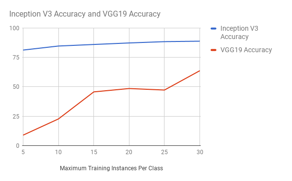

# Transfer Learning Experiments with Keras

This repository contains several explorations pertaining to transfer learning
(also sometimes referred to as domain adaptation), using ImageNet as a source
dataset and
[Caltech-101](http://www.vision.caltech.edu/Image_Datasets/Caltech101/) as a
target dataset. It is able to achieve **90.79%** test accuracy on Caltech-101
in just 129 seconds of CPU training on a standard Macbook Air.

## Quick Start

1. Follow instructions to install [keras](https://github.com/fchollet/keras)
2. Install [h5py](http://www.h5py.org/) to cache and load models.
3. Download [Caltech-101](http://www.vision.caltech.edu/Image_Datasets/Caltech101/) and place under the `data/caltech_101` directory
4. `python generate_cnn_codes.py` to generate the CNN codes (time intensive step)
5. `python train_model.py` to train the transfer learned model

## Helpful Resources

Here are some resources I found helpful for these experiments:

* [http://ruder.io/transfer-learning/index.html#fn:13](http://ruder.io/transfer-learning/index.html#fn:13)
* [http://cs231n.github.io/transfer-learning/](http://cs231n.github.io/transfer-learning/)
* [Keras documentation on applications](https://keras.io/applications/)
* [CNN Features off-the-shelf: an Astounding Baseline for Recognition](https://arxiv.org/pdf/1403.6382.pdf)
* [Visualizing and Understanding Convolutional Networks](https://arxiv.org/pdf/1311.2901v3.pdf)

## Model

This repository trains a softmax multi-class classification model that takes as
input the final convolutional layer of a model pre-trained on ImageNet, and
outputs a set of class probabilities. Although transfer learning experiments
often involve the fine-tuning of all layer weights, these experiments only
train a single layer of weights, to ensure the possibility of training in a
low-resource environment. In fact, the most computationally-intensive portion
is computing the forward-pass CNN codes on each training example (takes a few
hours on a laptop) whereas the training can achieve a reasonable accuracy in a
matter of minutes.

One gotcha for that may have "polluted" some of these experimental results is
that Caltech-101 contains a small amount of overlap of 44 images with ImageNet,
out of 9,144 total images ([as noted in this
paper](https://arxiv.org/pdf/1311.2901v3.pdf)). Because I didn't have the
resources to retrain an ImageNet model without this overlap, I have ignored this
pollution for now.

## Experiments

The performance numbers from the following experiments are taken from
experiments on my Macbook Air, with a 2.2 GHz Intel Core i7 and 8 GB of DDR3
RAM. I split each class in the Caltech-101 dataset into 70% training and 30%
test to run these experiments.

#### [Inception V3](https://arxiv.org/pdf/1512.00567.pdf)

The final convolutional layer of the inception v3 model has an output shape of 5 x 5 x 2048,
resulting in a flattened CNN code of 51,200 dimensions. Since this is a quite large softmax
layer, training on my laptop in a short amount of time was more intensive than VGG19. However,
I was able to reach a performance of **90.79%** test accuracy in just **5 epochs of training (129
seconds)**. Quite remarkable for such a small amount of epochs / training data.

#### [VGG19](https://arxiv.org/pdf/1409.1556.pdf)

The final convolutional layer of VGG19 has an output shape of 7 x 7 x 512, or
25,008 flattened.  This model converged more slowly than inception, but I was
able to train it for more epochs due to the smaller size. I got a performance
of **79.08%** test accuracy after **25 epochs of training (328 seconds)**

#### Number of Training Instances

One interesting application of transfer learning in addition to it's efficiency
is the surprising effectiveness in a low data setting. To visualize this, I
have conducted experiments where I have limited the maximum number of training
instances per class to various levels and charted the resulting model test accuracy:

It's quite incredible to note the generalization of these models with such
little training data. On the inception model, it is almost a little difficult
to believe - perhaps the pollution of the ImageNet dataset is coming into play
here.

## TODO(yoavz)

Some interesting directions to experiment with... if I ever find the time...

1. Learn on a different target dataset, such as a hand-collected facial
   recognition dataset. These experiments indicate that I may not need that
   many training instances for effective performance.
2. Remove "pollution" from imagenet models to achieve true precision results
3. Train models with fine-tuning
